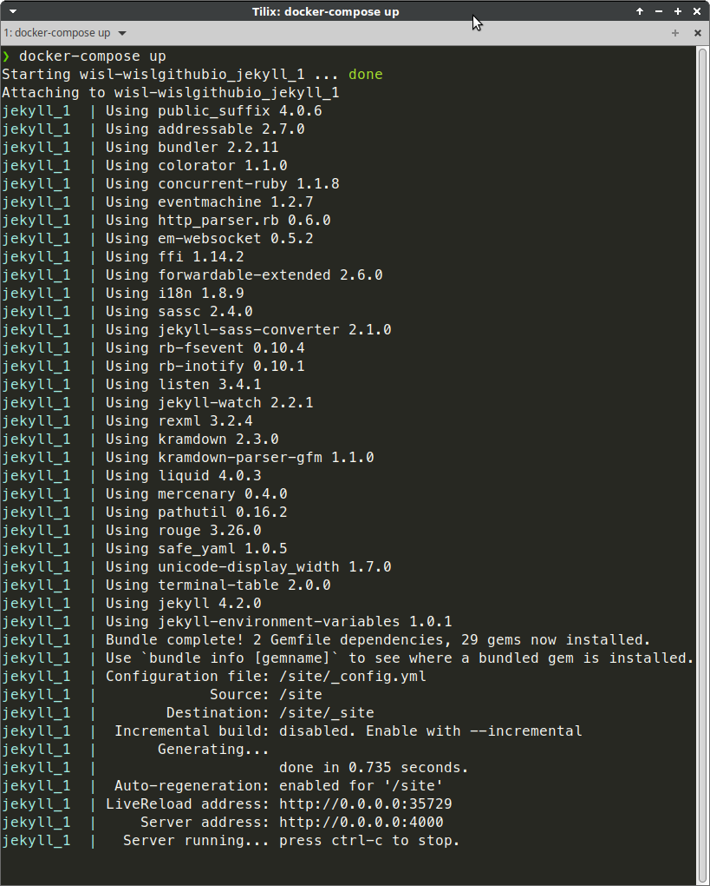

# wisl.earth website

- [wisl.earth website](#wislearth-website)
  - [Development environment](#development-environment)
    - [Sample output](#sample-output)
  - [Github Actions](#github-actions)
  - [Publishing exclusions](#publishing-exclusions)

## Development environment

`docker-compose up` builds the `Dockerfile` and serves Jekyll locally on port `4000`

`--livereload` is enabled, so that content updates are automatically refreshed

### Sample output



```console
❯ docker-compose up
Recreating wisl-wislgithubio_jekyll_1 ... done
Attaching to wisl-wislgithubio_jekyll_1
jekyll_1  | Fetching gem metadata from https://rubygems.org/.........
jekyll_1  | Using public_suffix 4.0.6
jekyll_1  | Using bundler 2.2.11
jekyll_1  | Using colorator 1.1.0
jekyll_1  | Using concurrent-ruby 1.1.8
jekyll_1  | Using eventmachine 1.2.7
jekyll_1  | Using http_parser.rb 0.6.0
jekyll_1  | Using ffi 1.14.2
jekyll_1  | Using forwardable-extended 2.6.0
jekyll_1  | Using rb-fsevent 0.10.4
jekyll_1  | Using liquid 4.0.3
jekyll_1  | Using mercenary 0.4.0
jekyll_1  | Using rouge 3.26.0
jekyll_1  | Using safe_yaml 1.0.5
jekyll_1  | Using unicode-display_width 1.7.0
jekyll_1  | Using addressable 2.7.0
jekyll_1  | Using i18n 1.8.9
jekyll_1  | Using sassc 2.4.0
jekyll_1  | Using rb-inotify 0.10.1
jekyll_1  | Using terminal-table 2.0.0
jekyll_1  | Fetching rexml 3.2.4
jekyll_1  | Using em-websocket 0.5.2
jekyll_1  | Using pathutil 0.16.2
jekyll_1  | Using listen 3.4.1
jekyll_1  | Using jekyll-watch 2.2.1
jekyll_1  | Using jekyll-sass-converter 2.1.0
jekyll_1  | Installing rexml 3.2.4
jekyll_1  | Using kramdown 2.3.0
jekyll_1  | Using kramdown-parser-gfm 1.1.0
jekyll_1  | Using jekyll 4.2.0
jekyll_1  | Fetching jekyll-environment-variables 1.0.1
jekyll_1  | Installing jekyll-environment-variables 1.0.1
jekyll_1  | Bundle complete! 2 Gemfile dependencies, 29 gems now installed.
jekyll_1  | Use `bundle info [gemname]` to see where a bundled gem is installed.
jekyll_1  | Configuration file: /site/_config.yml
jekyll_1  |             Source: /site
jekyll_1  |        Destination: /site/_site
jekyll_1  |  Incremental build: disabled. Enable with --incremental
jekyll_1  |       Generating... 
jekyll_1  |                     done in 0.81 seconds.
jekyll_1  |  Auto-regeneration: enabled for '/site'
jekyll_1  | LiveReload address: http://0.0.0.0:35729
jekyll_1  |     Server address: http://0.0.0.0:4000
jekyll_1  |   Server running... press ctrl-c to stop.
jekyll_1  |       Regenerating: 1 file(s) changed at 2021-03-25 23:30:04
jekyll_1  |                     index.md
jekyll_1  |                     ...done in 0.773655022 seconds.
```

## Github Actions

Commits to the `source` branch trigger a Github action to deploy GitHub Pages

## Publishing exclusions

Exclude files from publishing by adding them to `exclude:` in `_config.yml`